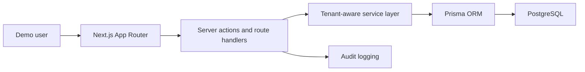

# SAICC Architecture

Milestone 1 keeps the platform modular: UI routes call server actions or service functions, service functions enforce tenant-scoped database access, and sensitive actions emit audit logs.

## Core Entities

- Tenant
- User
- Session
- AI Tool
- AI Usage Event
- Security Alert
- Incident
- AI Agent
- Cost Record
- Audit Log
